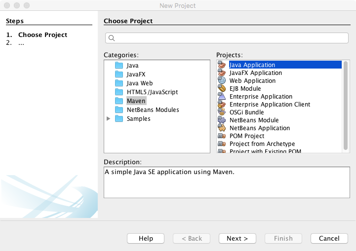
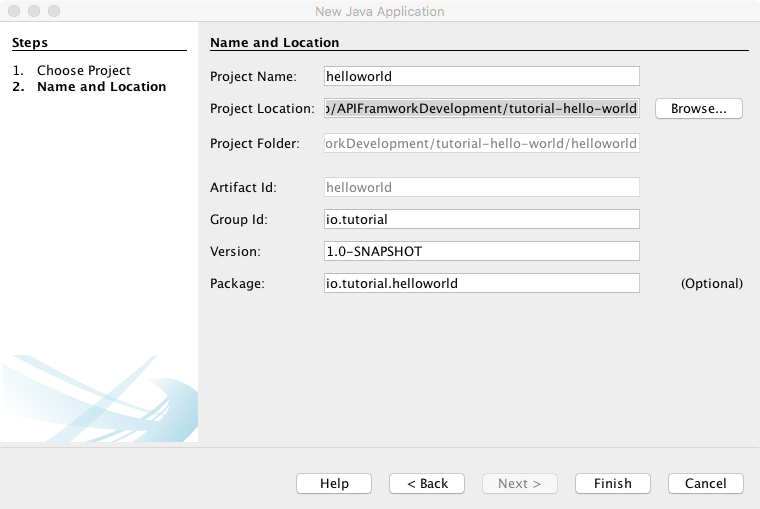

== Create Maven Project using Netbean

NOTE: Below steps are optional. You can clone this project from
          https://github.com/vinscom/api-framwork-start.git

. Create Project Folder *api-framwork-start*. This will be used as base folder.
. Create new project +

. Save project to *api-framwork-start* location +

. Add required dependencies to POM
+
[source, xml,linenums,indent=0]
----
include::./../pom.xml[tag=requiredDependencies]
----
+
. Additional project dependencies
+
[source, xml,linenums,indent=0]
----
include::./../pom.xml[tag=optionalDependencies]
----

. Create *api-framwork-start/config-layers/tutorial-simple-get-api* and
  *api-framwork-start/config-layers/test* folder to store all configuration
+
NOTE: *common* configuration is for production use. *test* configuration can be
          used to add new or override *common* configuration during unit test

. Create *api-framwork-start/src/assembly/tutorial-simple-get-api-config.xml*
+
[source, xml,linenums,indent=0]
----
include::./../src/assembly/tutorial-simple-get-api-config.xml[]
----

This configuration will make sure that your *tutorial-simple-get-api-config* config layers
is packed and installed as artefact in maven repository.

. Add plugins to Maven
+
[source, xml,linenums,indent=0]
----
include::./../pom.xml[tag=plugin]
----
+
.Argument Line
To pass correct layer parameters to Test, we use argLine.
+
[source, xml,linenums,indent=0]
----
include::./../pom.xml[tag=argLine]
----
+
[%header,cols="1,2a,3a"]
|===
| Argument | Value | Description
| vertx.logger-delegate-factory-class-name
| io.vertx.core.logging.Log4j2LogDelegateFactory
| Enable Log4J based logging.
| glue.layers
|
[%header]
!===
! Layer ! Description
! ${settings.localRepository}/in/erail/api-framwork/1.0-SNAPSHOT/api-framwork-1.0-SNAPSHOT-common-config.zip
! API Framework Configuration Layer
! ${project.basedir}/config-layers/tutorial-simple-get-api
! Our project configuration layer
! ${project.basedir}/config-layers/test
! Our project test configuration layer. Any test specific configuration can be done in this
layer
!===
| All configuration layers. Configuration layers are read in same order as defined in
argument. Layer configuration is read from right to left. Means, left configuration will
override right configuration, if same configuration is also present in right layer.

NOTE: Configuration are managed at individual property level. So, if two
properties file have same configuration file, but, different property inside those
configuration file, then configuration file is merged. For more information read
Glue documentation.
|===
